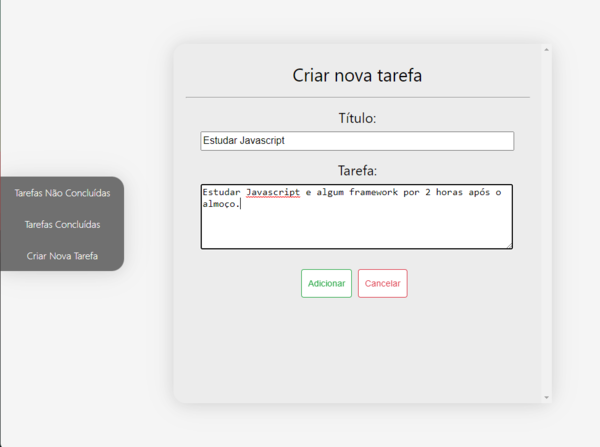
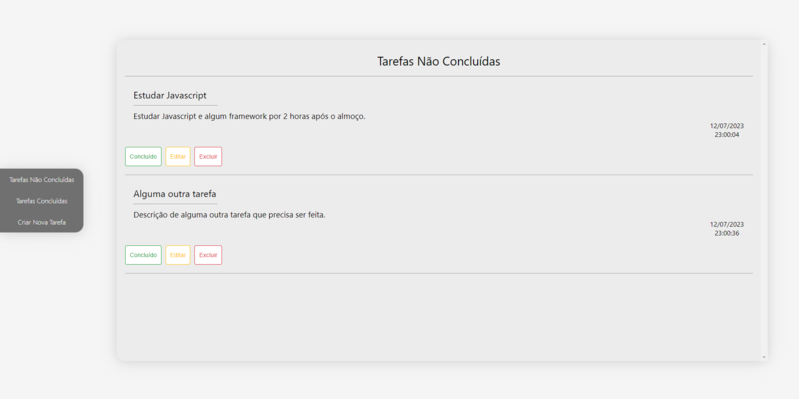
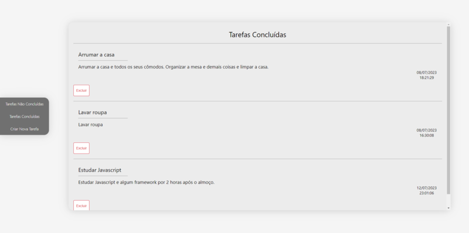

# Tarefas

### Um site que permite ao usuário adicionar, editar, excluir e marcar como concluída uma tarefa que ele tenha que executar

#### O frontend foi feito utilizando React para os componentes e as rotas e a comunicação com o backend foi feita utilizando o Axios.
#### No backend foi utilizado o json-server para persistir os dados no computador na forma de um arquivo json de modo a simplificar o processo.

 

 

 
